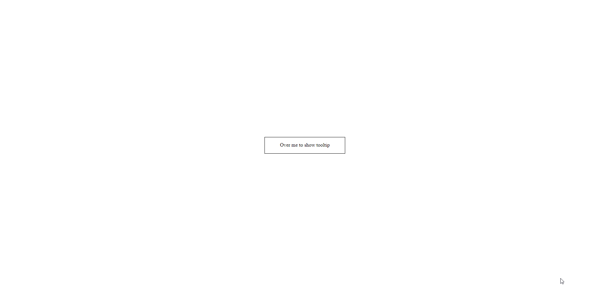

# Stencil Portal

This component is developed with StencilJS and provides a first-class option for rendering children in a DOM node that exists outside the DOM hierarchy of the parent or reference component.

A typical use case for portals is when a main component has an overflow style: hidden or z-index, but needs the element to "come out" visually from its container. For example, dialog boxes, hovercards and tooltips.

# How does it work?

The component portal component requires us to pass a component reference from which it will calculate the position (see in the example the component tooltip component has a reference on the Host tab)

```bash
<Host ref={(el) => (this.tooltipRef = el)}>
```

In this same component we can see that there is a label ```<Slot />```. This is used for the example, and is the place where the parent's child component will be drawn (in this case a <span /> where it will be possible to hover and show the content that is in the portal)



When the cursor is placed over the element, the portal is positioned absolutely on top of the referenced element by default


## How to run the example

1. Install _nodejs_ 14.5.0 from [this link](https://nodejs.org/dist/v14.5.0/node-v14.5.0-x64.msi) or using [Node Version Manager](https://github.com/coreybutler/nvm-windows/releases).
2. Install _yarn_ 1.22.5 globally executing the following command:

```bash
npm install -g yarn@1.22.5
```

3. Install all project dependencies from SPA root folder:

```bash
yarn
```

4. Start the project in local development mode with:

```bash
yarn start
```


